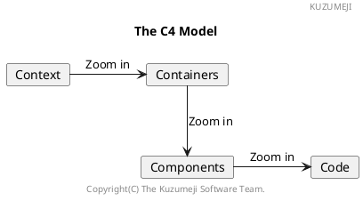
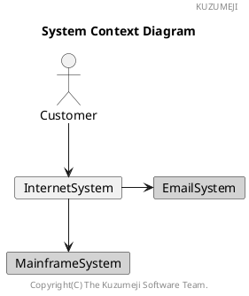
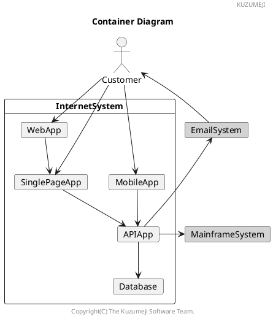
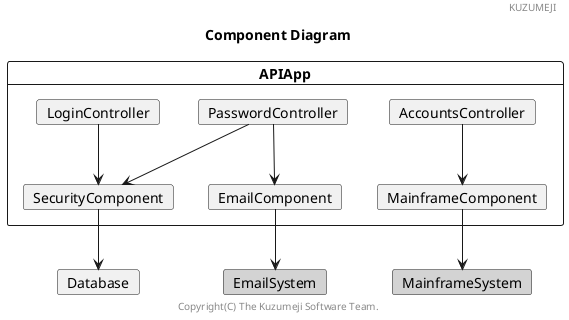
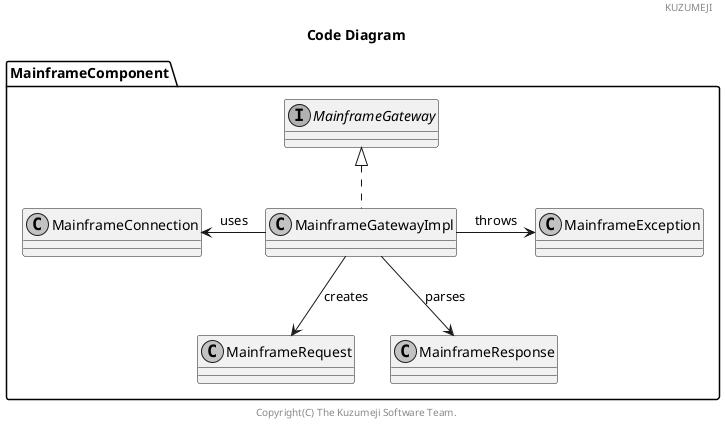

# Quickstart

## The C4 Model

```plantuml
@startuml
skinparam monochrome true
skinparam defaultFontName "Yu Gothic UI"
header KUZUMEJI
footer Copyright(C) The Kuzumeji Software Team.
title The C4 Model
card Context
card Containers
card Components
card Code
Context -> Containers : Zoom in
Containers --> Components : Zoom in
Components -> Code : Zoom in
@enduml
```

## System Context

```plantuml
@startuml
skinparam monochrome true
skinparam defaultFontName "Yu Gothic UI"
header KUZUMEJI
footer Copyright(C) The Kuzumeji Software Team.
title System Context Diagram
actor Customer
card InternetSystem
card MainframeSystem #lightgray
card EmailSystem #lightgray
Customer --> InternetSystem
InternetSystem --> MainframeSystem
InternetSystem -> EmailSystem
@enduml
```

## Container

```plantuml
@startuml
skinparam monochrome true
skinparam defaultFontName "Yu Gothic UI"
header KUZUMEJI
footer Copyright(C) The Kuzumeji Software Team.
title Container Diagram
actor Customer
card MainframeSystem #lightgray
card EmailSystem #lightgray
Customer <-- EmailSystem
card InternetSystem {
    card WebApp
    card SinglePageApp
    card MobileApp
    card APIApp
    card Database
    Customer --> WebApp
    Customer --> SinglePageApp
    WebApp --> SinglePageApp
    Customer --> MobileApp
    SinglePageApp --> APIApp
    MobileApp --> APIApp
    APIApp --> Database
    EmailSystem <-- APIApp
    APIApp -> MainframeSystem
}
@enduml
```

## Component

```plantuml
@startuml
skinparam monochrome true
skinparam defaultFontName "Yu Gothic UI"
header KUZUMEJI
footer Copyright(C) The Kuzumeji Software Team.
title Component Diagram
card MainframeSystem #lightgray
card EmailSystem #lightgray
card Database
card APIApp {
    card LoginController
    card SecurityComponent
    LoginController --> SecurityComponent
    SecurityComponent --> Database
    card PasswordController
    card EmailComponent
    PasswordController --> EmailComponent
    PasswordController --> SecurityComponent
    EmailComponent --> EmailSystem
    card AccountsController
    card MainframeComponent
    AccountsController --> MainframeComponent
    MainframeComponent --> MainframeSystem
}
@enduml
```

## Code

```plantuml
@startuml
skinparam monochrome true
skinparam defaultFontName "Yu Gothic UI"
header KUZUMEJI
footer Copyright(C) The Kuzumeji Software Team.
title Code Diagram
package MainframeComponent {
    class MainframeGatewayImpl implements MainframeGateway
    class MainframeConnection
    class MainframeRequest
    class MainframeResponse
    class MainframeException
    MainframeConnection <- MainframeGatewayImpl : uses
    MainframeGatewayImpl --> MainframeRequest : creates
    MainframeGatewayImpl --> MainframeResponse : parses
    MainframeGatewayImpl -> MainframeException : throws
}
@enduml
```
