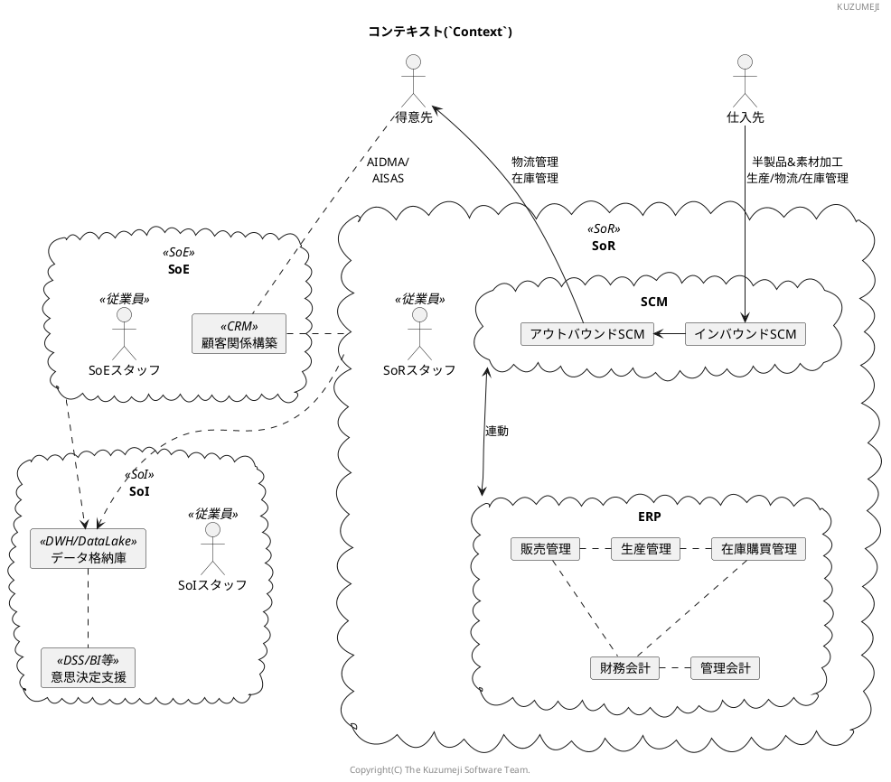

# バックエンド(`Backend`)

## コンテキスト(`Context`)

```plantuml
@startuml
skinparam monochrome true
skinparam defaultFontName "UDEV Gothic JPDOC"
header KUZUMEJI
footer Copyright(C) The Kuzumeji Software Team.
title コンテキスト(`Context`)
actor 得意先
actor 仕入先
cloud SoE <<SoE>> {
    actor SoEスタッフ <<従業員>>
    card 顧客関係構築 <<CRM>>
    得意先 .. 顧客関係構築 : AIDMA/\nAISAS
}
cloud SoR <<SoR>> {
    actor SoRスタッフ <<従業員>>
    cloud SCM {
        card アウトバウンドSCM
        card インバウンドSCM
        得意先 <-- アウトバウンドSCM : 物流管理\n在庫管理
        仕入先 --> インバウンドSCM : 半製品&素材加工\n生産/物流/在庫管理
        アウトバウンドSCM <- インバウンドSCM
    }
    cloud ERP {
        card 財務会計
        card 管理会計
        card 販売管理
        card 在庫購買管理
        card 生産管理
        販売管理 . 生産管理
        生産管理 . 在庫購買管理
        販売管理 .. 財務会計
        在庫購買管理 .. 財務会計
        財務会計 . 管理会計
    }
    SCM <--> ERP : 連動
}
顧客関係構築 . SoR
cloud SoI <<SoI>> {
    actor SoIスタッフ <<従業員>>
    card データ格納庫 <<DWH/DataLake>>
    card 意思決定支援 <<DSS/BI等>>
    SoE ..> データ格納庫
    SoR ..> データ格納庫
    データ格納庫 .. 意思決定支援
}
@enduml
```
