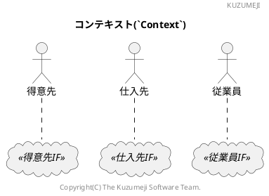

# フロントエンド(`Frontend`)

## コンテキスト(`Context`)

```plantuml
@startuml
skinparam monochrome true
skinparam defaultFontName "UDEV Gothic JPDOC"
header KUZUMEJI
footer Copyright(C) The Kuzumeji Software Team.
title コンテキスト(`Context`)
actor 得意先
actor 仕入先
actor 従業員
cloud 得意先IF <<得意先IF>> as "
"
cloud 仕入先IF <<仕入先IF>> as "
"
cloud 従業員IF <<従業員IF>> as "
"
得意先 .. 得意先IF
仕入先 .. 仕入先IF
従業員 .. 従業員IF
@enduml
```
