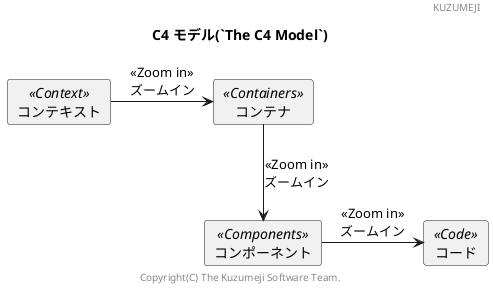
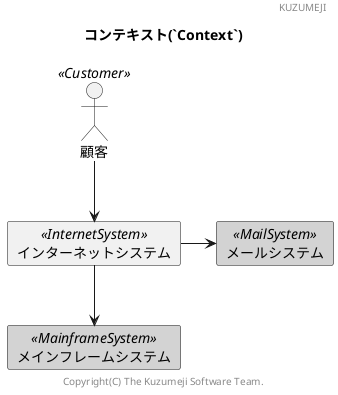
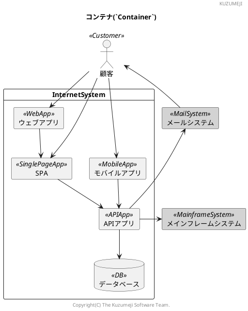
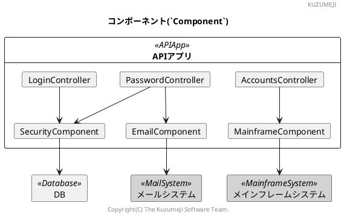
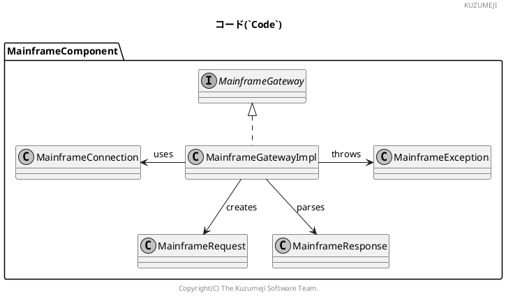

# クイックスタート(`Quickstart`)

## C4 モデル(`The C4 Model`)

```plantuml
@startuml
skinparam monochrome true
skinparam defaultFontName "Yu Gothic UI"
header KUZUMEJI
footer Copyright(C) The Kuzumeji Software Team.
title C4 モデル(`The C4 Model`)
card コンテキスト <<Context>>
card コンテナ <<Containers>>
card コンポーネント <<Components>>
card コード <<Code>>
コンテキスト -> コンテナ : <<Zoom in>>\nズームイン
コンテナ --> コンポーネント : <<Zoom in>>\nズームイン
コンポーネント -> コード : <<Zoom in>>\nズームイン
@enduml
```

## コンテキスト(`Context`)

```plantuml
@startuml
skinparam monochrome true
skinparam defaultFontName "Yu Gothic UI"
header KUZUMEJI
footer Copyright(C) The Kuzumeji Software Team.
title コンテキスト(`Context`)
actor 顧客 <<Customer>>
card インターネットシステム <<InternetSystem>>
card メインフレームシステム <<MainframeSystem>> #lightgray
card メールシステム <<MailSystem>> #lightgray
顧客 --> インターネットシステム
インターネットシステム --> メインフレームシステム
インターネットシステム -> メールシステム
@enduml
```

## コンテナ(`Container`)

```plantuml
@startuml
skinparam monochrome true
skinparam defaultFontName "Yu Gothic UI"
header KUZUMEJI
footer Copyright(C) The Kuzumeji Software Team.
title コンテナ(`Container`)
actor 顧客 <<Customer>>
card メインフレームシステム <<MainframeSystem>> #lightgray
card メールシステム <<MailSystem>> #lightgray
顧客 <-- メールシステム
card InternetSystem {
    card ウェブアプリ <<WebApp>>
    card SPA <<SinglePageApp>>
    card モバイルアプリ <<MobileApp>>
    card APIアプリ <<APIApp>>
    database データベース <<DB>>
    顧客 --> ウェブアプリ
    顧客 --> SPA
    ウェブアプリ --> SPA
    顧客 --> モバイルアプリ
    SPA --> APIアプリ
    モバイルアプリ --> APIアプリ
    APIアプリ --> データベース
    メールシステム <-- APIアプリ
    APIアプリ -> メインフレームシステム
}
@enduml
```

## コンポーネント(`Component`)

```plantuml
@startuml
skinparam monochrome true
skinparam defaultFontName "Yu Gothic UI"
header KUZUMEJI
footer Copyright(C) The Kuzumeji Software Team.
title コンポーネント(`Component`)
card メインフレームシステム <<MainframeSystem>> #lightgray
card メールシステム <<MailSystem>> #lightgray
card DB <<Database>>
card APIアプリ <<APIApp>> {
    card LoginController
    card SecurityComponent
    LoginController --> SecurityComponent
    SecurityComponent --> DB
    card PasswordController
    card EmailComponent
    PasswordController --> EmailComponent
    PasswordController --> SecurityComponent
    EmailComponent --> メールシステム
    card AccountsController
    card MainframeComponent
    AccountsController --> MainframeComponent
    MainframeComponent --> メインフレームシステム
}
@enduml
```

## コード(`Code`)

```plantuml
@startuml
skinparam monochrome true
skinparam defaultFontName "Yu Gothic UI"
header KUZUMEJI
footer Copyright(C) The Kuzumeji Software Team.
title コード(`Code`)
package MainframeComponent {
    class MainframeGatewayImpl implements MainframeGateway
    class MainframeConnection
    class MainframeRequest
    class MainframeResponse
    class MainframeException
    MainframeConnection <- MainframeGatewayImpl : uses
    MainframeGatewayImpl --> MainframeRequest : creates
    MainframeGatewayImpl --> MainframeResponse : parses
    MainframeGatewayImpl -> MainframeException : throws
}
@enduml
```
