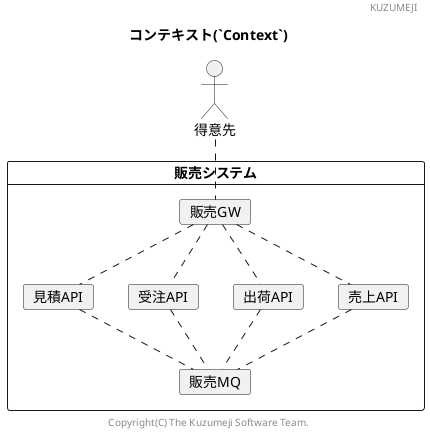

# SAP ERP

## コンテキスト(`Context`)

```plantuml
@startuml
skinparam monochrome true
skinparam defaultFontName "UDEV Gothic JPDOC"
header KUZUMEJI
footer Copyright(C) The Kuzumeji Software Team.
title コンテキスト(`Context`)
actor 得意先
card 販売システム {
  card 見積API
  card 受注API
  card 出荷API
  card 売上API
  card 販売GW
  得意先 .. 販売GW
  販売GW .. 見積API
  販売GW .. 受注API
  販売GW .. 出荷API
  販売GW .. 売上API
  card 販売MQ
  見積API .. 販売MQ
  受注API .. 販売MQ
  出荷API .. 販売MQ
  売上API .. 販売MQ
}
@enduml
```
